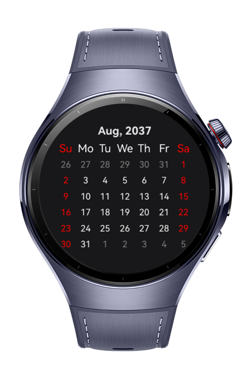
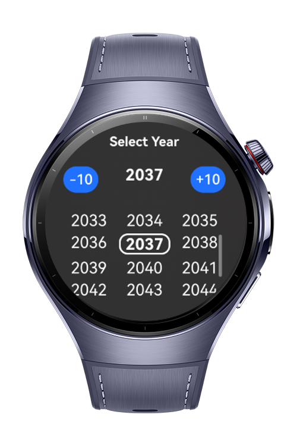
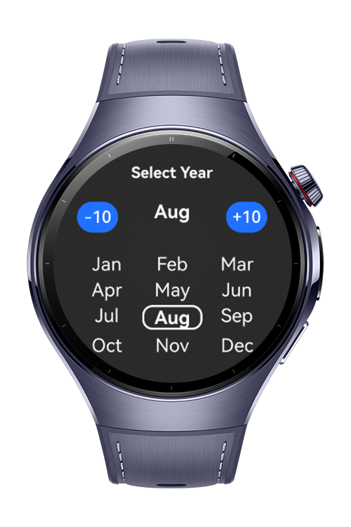

> **Note:** To access all shared projects, get information about environment setup, and view other guides, please visit [Explore-In-HMOS-Wearable Index](https://github.com/Explore-In-HMOS-Wearable/hmos-index).

# How To Create Calendar Picker in Wearable

**CalendarPicker** is custom calendar picker for wearables.

# Preview

<div>
  
  
  
  
</div>

# Use Cases

- Picker month, year and day on your wearable devices.

# Tech Stack
- **Languages**: ArkTS, ArkUI
- **Frameworks**: HarmonyOS 5.0.39 Beta2 SDK
- **Tools**: DevEco Studio 6.0.0 Beta2
- **Libraries**:
    - `@kit.ArkUI`
    - `@kit.AbilityKit`
    - `@kit.BasicServicesKit`
    - `@kit.CalendarKit`
    - `dayjs`

# Required Permissions
- `ohos.permission.WRITE_CALENDAR`
- `ohos.permission.READ_CALENDAR`

# Directory Structure

```
entry/src/main/ets/
├───components
│       SmartCalendarPicker.ets
│       YearMonthSelector.ets
├───entryability
│       EntryAbility.ets
├───entrybackupability
│       EntryBackupAbility.ets
├───lib
│       constants.ts
│       types.ts
│       utils.ts
├───models
│       GlobalContext.ets
│       YearDataSource.ets
│       YearItem.ets       
├───pages
│       Index.ets
├───services
│       CalendarService.ets
│       EventService.ets
│       PermissionHandler.ets
├───viewmodels
│       Event.ets
│       ListDataSource.ets
└─── 
```

# Constraints and Restrictions
## Supported Device
- Huawei Watch 5

# LICENSE
**CalendarPicker** is distributed under the terms of the MIT License.
See the [license](LICENSE) for more information. 